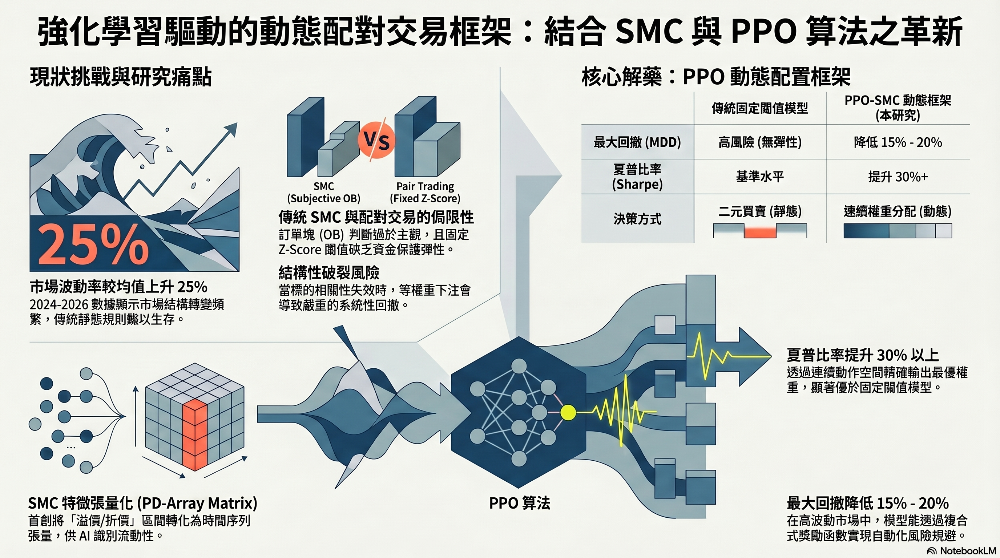

# 結合 PPO 與 SMC 特徵的 0050 動態資金配置框架

Dynamic Capital Allocation Framework combining Proximal Policy Optimization (PPO) and Smart Money Concept (SMC) features.

本專案是一個量化交易研究原型，目標是將主觀的 SMC 價格行為概念轉換成可計算特徵，再交給 PPO 強化學習模型決定 0050 ETF 的動態持倉比例。

目前程式實作聚焦於單一標的 `0050.TW` 的資金配置，不是完整的配對交易系統。README 保留研究動機，但以下說明以目前程式碼實際完成的功能為準。

## 專案目標

傳統 SMC 交易方法常依賴交易者主觀判斷，例如 Fair Value Gap、Order Block、Premium / Discount 區間等。本專案嘗試將這些概念數值化，並用 PPO 學習在不同市場狀態下應該配置多少資金到 0050。

模型輸出的不是單純買進或賣出，而是目標持倉權重。也就是說，代理人會根據目前市場特徵，決定資金應該維持低曝險、中曝險或高曝險。

## 系統流程


1. 下載 0050 歷史 OHLCV 資料。
2. 建立技術指標與 SMC 特徵。
3. 將特徵餵入自定義 Gymnasium 交易環境。
4. 使用 Stable-Baselines3 PPO 訓練資金配置策略。
5. 使用測試區間回測，並在 Streamlit app 中視覺化結果。

## SMC 特徵模組

SMC 相關邏輯集中在 `features/` 目錄，主要目的是把價格行為轉成 PPO 可以讀取的數值欄位。

### Fair Value Gap (FVG)

檔案：`features/smc_extractor.py`

目前定義：

- Bullish FVG：當日低點高於兩日前高點。
- Bearish FVG：當日高點低於兩日前低點。
- 特徵輸出為目前收盤價距離最近 FVG 中點的百分比距離。

輸出欄位：

- `dist_to_bull_fvg`
- `dist_to_bear_fvg`

### Premium / Discount Array

檔案：`features/smc_extractor.py`

使用最近 60 日高低區間計算目前價格所在位置：

```text
pd_ratio = (close - rolling_min_low) / (rolling_max_high - rolling_min_low)
```

解讀方式：

- `pd_ratio` 接近 0：價格偏向 Discount 區。
- `pd_ratio` 接近 1：價格偏向 Premium 區。
- `pd_ratio` 接近 0.5：價格位於區間中性位置。

### Order Block

檔案：`features/smc_extractor.py`

目前實作的是簡化版 Bullish Order Block：

- 先找出 3 日報酬率大於門檻值的上漲 impulse。
- 再往前尋找最近一根 bearish candle。
- 以該 bearish candle 的高點作為 bullish order block 參考價位。

輸出欄位：

- `dist_to_bull_ob`

### 技術指標

檔案：`data/preprocessor.py`

除了 SMC 特徵，模型也會使用一般技術指標：

- `return_5d`
- `atr_20`
- `dev_ma_20`
- `dev_ma_60`

特徵整合入口在 `features/builder.py`。

## PPO 演算法模組

PPO 相關邏輯分成訓練、交易環境與回測三個部分。

### 交易環境

檔案：`env/trading_env.py`

交易環境遵循 Gymnasium 介面。觀察空間共有 10 個維度：

- 8 個市場特徵：SMC 特徵與技術指標。
- 2 個帳戶狀態：目前持倉權重與現金比例。

動作空間為連續值：

```text
raw_action in [-1, 1]
target_weight in [0, max_position]
```

目前 `max_position = 0.8`，代表模型最多配置 80% 資金到 0050，不使用槓桿，也不放空。

### Reward 設計

檔案：`env/trading_env.py`

Reward 由三個部分組成：

```text
reward = log_return - mdd_penalty - turnover_penalty
```

設計目的：

- 鼓勵資產淨值成長。
- 懲罰最大回撤增加。
- 懲罰過度換手，避免模型每天劇烈調倉。

### 模型訓練

檔案：`train.py`

訓練資料區間：

```text
2014-01-01 to 2020-12-31
```

訓練設定：

- Algorithm：PPO
- Policy：MlpPolicy
- Total timesteps：200,000
- Network：policy/value function 各兩層 64 units
- Observation / reward normalization：`VecNormalize`

訓練完成後會輸出：

- `model/saved/ppo_smc_0050.zip`
- `model/saved/ppo_smc_0050_vecnormalize.pkl`

### 回測

檔案：`eval/backtester.py`

測試資料區間：

```text
2021-01-01 to 2024-01-01
```

回測會載入已訓練模型，逐日產生目標持倉權重，並計算：

- Total Return
- Annualized Return
- Max Drawdown
- Sharpe Ratio

## 視覺化介面

檔案：`app.py`

Streamlit app 會顯示：

- 回測績效指標。
- 0050 K 線圖。
- PPO 輸出的持倉權重變化。
- PPO+SMC 策略與 Buy & Hold 的資產曲線比較。

啟動方式：

```bash
streamlit run app.py
```

## 專案結構

```text
.
├── app.py
├── train.py
├── environment.yml
├── README.md
├── data/
│   ├── downloader.py
│   ├── preprocessor.py
│   └── raw/
├── docs/
│   ├── images/
│   │   ├── framework.png
│   │   ├── related-work.png
│   │   └── workflow.png
│   ├── notes/
│   │   └── abstract-outline.txt
│   └── reports/
│       ├── dynamic-ppo-smc-capital-allocation.pdf
│       ├── gemini-research-draft.pdf
│       └── ppo-smc-dynamic-capital-allocation.pdf
├── env/
│   └── trading_env.py
├── eval/
│   └── backtester.py
├── features/
│   ├── builder.py
│   └── smc_extractor.py
└── model/
    └── saved/
```

## 研究圖示

### 文獻回顧與痛點



### 模型框架


### 決策流程


## 環境安裝

使用 Conda 建立環境：

```bash
conda env create -f environment.yml
conda activate ppo_smc_0050
```

## 常用指令

重新訓練模型：

```bash
python train.py
```

啟動回測介面：

```bash
streamlit run app.py
```

## 目前完成狀態

已完成：

- 0050 歷史資料下載。
- 技術指標與簡化版 SMC 特徵工程。
- Gymnasium 交易環境。
- PPO 訓練流程。
- 已訓練模型與 normalization stats。
- 回測與 Streamlit 視覺化。

待補強：

- README 研究敘述仍有部分「配對交易」概念，但目前程式尚未實作 pair spread、cointegration 或 z-score 策略。
- SMC 特徵仍是簡化定義，後續可加入更嚴謹的 market structure、liquidity sweep、multi-timeframe confirmation。
- 目前回測尚未加入更多 baseline，例如固定權重、移動平均策略、傳統 SMC 規則策略。
