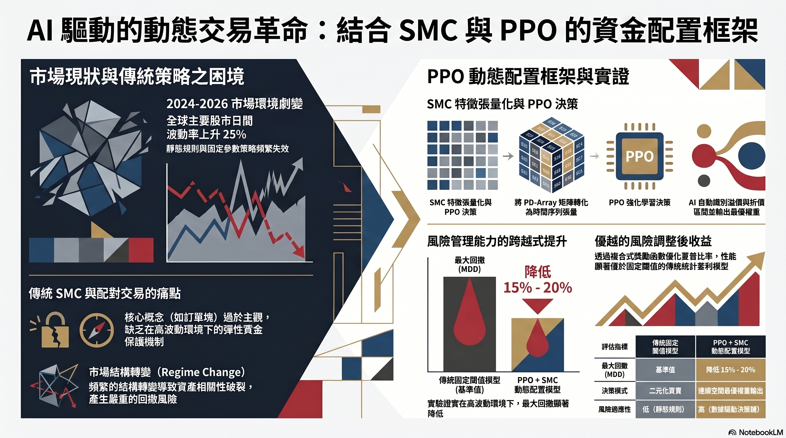
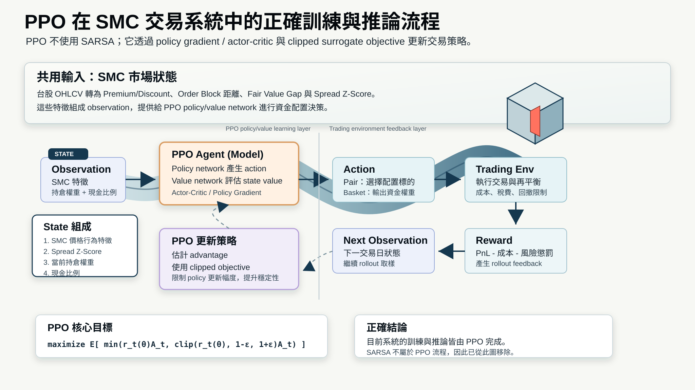
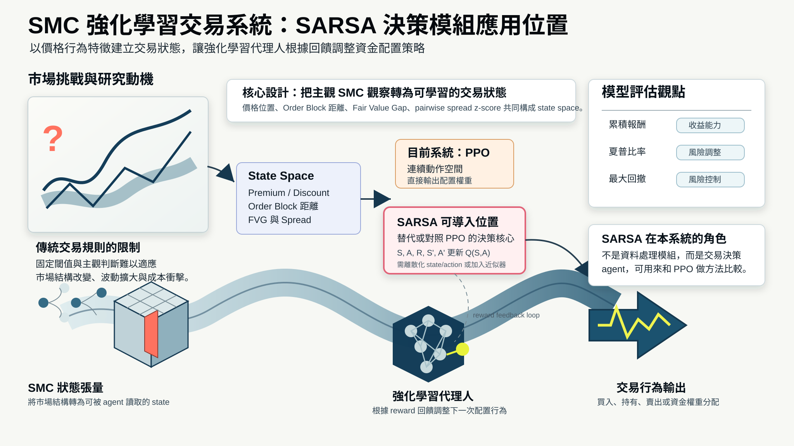
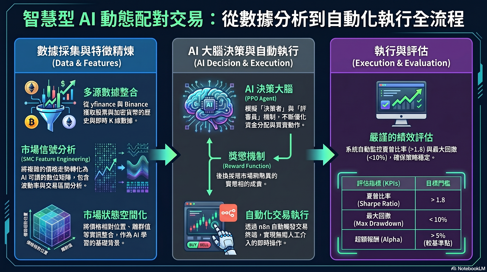

# TWSE SMC + PPO 多股票動態資金配置系統

本專案將 **Smart Money Concept (SMC)** 的市場結構訊號轉換成可計算的特徵，並使用 **Stable-Baselines3 PPO** 訓練強化學習交易模型，讓模型在多檔台股標的之間進行動態資金配置。

核心目標不是單純預測隔日漲跌，而是建立一個能夠：

- 讀取台股日線 OHLCV 資料。
- 產生 SMC 特徵與 pairwise spread z-score。
- 在 Gymnasium 交易環境中模擬資金、持股、手續費、證交稅與漲停限制。
- 讓 PPO 根據 state 輸出 action，並轉換成投資組合權重。
- 使用 out-of-sample 推論結果評估累積報酬率、Sharpe Ratio 與最大回撤。

## Demo

- 線上 Demo：[Streamlit App](https://drlfinalprojectproposal-43wylp7p2dzxjqbevjh9at.streamlit.app/)
- 介紹影片：[YouTube](https://youtu.be/_QB1i0-QLpc)



## 1. Introduction

傳統 SMC 交易概念常用來描述機構資金可能關注的價格區域，例如 Premium / Discount、Order Block、Fair Value Gap 等。然而，若只使用固定規則，很難在不同市場波動下決定：

- 哪一檔股票應該配置較高資金。
- 何時應該降低曝險。
- 交易成本與最大回撤是否值得承擔。
- Pair 與 Basket 投資組合在報酬與風險之間的取捨。

因此，本專案把 SMC 訊號整理成強化學習可使用的 state，並讓 PPO 學習資金配置策略。

## 2. Related Work

### PPO + SMC 整體流程

PPO 在本專案中扮演「決策器」角色；SMC 則提供市場狀態描述。整體流程可以理解為：

1. 從 yfinance 下載台股日線 OHLCV。
2. 由價格資料計算 SMC 特徵。
3. 加入 pair / basket 的 spread z-score。
4. 交易環境根據 action 執行再平衡。
5. PPO 根據 reward 更新 policy。



### State、Action 與 Reward

PPO 的訓練可以拆成三個核心元素：

- **State**：目前市場狀態，包括 SMC 特徵、spread z-score、目前持股權重與現金比例。
- **Action**：模型輸出的配置訊號，會被轉換成各股票的目標權重。
- **Reward**：根據 PnL、Sharpe adjustment、交易成本與 drawdown penalty 計算。

SARSA 圖可作為強化學習交易流程的概念對照：它同樣關注 state-action-return 的循環，但本專案實作上使用的是 PPO，而不是 SARSA。



## 3. Proposed Scheme

### 模型組合

本專案目前訓練兩個模型：

| Model | Tickers | 說明 | Model path |
| --- | --- | --- | --- |
| Pair model | `0050.TW`, `2330.TW` | 台灣 50 ETF 與台積電之間的相對配置 | `model/saved/ppo_model_pair.zip` |
| Basket model | `0050.TW`, `2330.TW`, `2412.TW` | 加入中華電信，形成較分散的三檔配置 | `model/saved/ppo_model_basket.zip` |



### SMC 特徵

每檔股票會產生以下 SMC 特徵：

| Feature | 說明 |
| --- | --- |
| `PD_Pos` | 價格位於 20 日 dealing range 的相對位置，範圍約為 0 到 1。 |
| `OB_Dist` | 收盤價相對最近 Order Block level 的距離。 |
| `FVG_Signal` | 是否存在尚未被回補的 Fair Value Gap。 |

Pair / Basket 模型另外使用 rolling spread z-score：

```text
Spread_ZScore_0050_TW_2330_TW
Spread_ZScore_0050_TW_2412_TW
Spread_ZScore_2330_TW_2412_TW
```

為了避免資料洩漏，程式會將 SMC 與 spread 特徵 `shift(1)`，使模型在第 t 日做決策時，只能使用第 t-1 日以前已知的市場資訊。

### Action 設計

Pair model 的 action shape：

```text
[-1, 1]
```

解讀方式：

```text
action > 0  -> 偏向配置 0050.TW
action < 0  -> 偏向配置 2330.TW
action ~= 0 -> 保留較高現金或低曝險
```

Basket model 的 action shape：

```text
[action_0050, action_2330, action_2412]
```

Basket model 會將正 action 分數正規化成各股票的目標權重；若所有 action 都小於等於 0，則模型會偏向持有現金。

### 台股交易限制

交易環境中加入較貼近台股市場的限制：

| 項目 | 設定 |
| --- | --- |
| 手續費 | `0.1425% * 0.6` |
| 0050.TW 賣出證交稅 | `0.1%` |
| 2330.TW / 2412.TW 賣出證交稅 | `0.3%` |
| 漲停限制 | 若價格達前收盤價 `* 1.10`，該筆 order 會被跳過 |
| 最大投入比例 | 預設 `max_position = 0.95` |

### Reward 設計

```text
Reward = PnL * Sharpe_Adjustment - Transaction_Cost - 2.0 * Drawdown_Penalty
```

這個 reward 不只鼓勵資產淨值上升，也會懲罰交易成本與新增最大回撤，使模型在追求報酬時同時考慮風險。

## 4. Simulation / Implementation

### 時間切分

| 階段 | 日期區間 | 說明 |
| --- | --- | --- |
| 訓練資料 | `2018-01-01 ~ 2024-12-31` | 用於 PPO 訓練 |
| 驗證 / 推論資料 | `2025-01-01 ~ 2026-05-01` | out-of-sample，不再更新模型權重 |

### PPO 訓練設定

主要設定位於 `train_pipeline.py`：

```python
TOTAL_TIMESTEPS = 500_000
INITIAL_BALANCE = 1_000_000.0
DEVICE = "cuda:0"
```

PPO hyperparameters：

```python
learning_rate=2e-4
n_steps=2048
batch_size=128
n_epochs=10
gamma=0.99
gae_lambda=0.95
clip_range=0.2
ent_coef=0.005
target_kl=0.03
policy_kwargs=dict(net_arch=dict(pi=[128, 128], vf=[128, 128]))
```

### Out-of-sample 推論結果

以下結果由 `predict_pipeline.py` 執行 deterministic inference 得到：

| Model | Final Net Worth | 累積報酬率 | Sharpe Ratio | 最大回撤 |
| --- | ---: | ---: | ---: | ---: |
| Pair model | `NTD 1,849,208` | `84.92%` | `1.84` | `-26.72%` |
| Basket model | `NTD 1,420,209` | `42.02%` | `1.41` | `-10.45%` |

解讀：

- Pair model 報酬率較高，但最大回撤也較深，代表波動與風險較大。
- Basket model 報酬率較低，但最大回撤較小，資金曲線相對平穩。
- 由於本專案是交易策略，不是分類模型，因此不以分類 accuracy 評估，而是以報酬率、Sharpe Ratio 與最大回撤作為主要績效指標。

## 5. Project Structure

```text
app.py                    # Streamlit 推論與視覺化 dashboard
train_pipeline.py         # PPO 訓練流程
predict_pipeline.py       # out-of-sample deterministic inference
twse_pipeline_common.py   # 資料下載、特徵工程、交易環境、績效計算
environment.yml           # Conda 環境設定
model/saved/              # 本地訓練模型
model/save_colab/         # Colab 訓練或匯出的模型
docs/images/              # 報告與 README 使用的架構圖
docs/reports/             # 研究草稿與報告 PDF
```

## 6. How to Run

### 建立環境

```bash
conda env create -f environment.yml
conda activate ppo_smc_0050
```

若要建立到指定位置：

```bash
conda env create -f environment.yml -p D:\Env\conda_envs\ppo_smc_0050
conda activate D:\Env\conda_envs\ppo_smc_0050
```

### 訓練模型

`train_pipeline.py` 目前設定為 CUDA-only：

```bash
python train_pipeline.py
```

輸出模型：

```text
model/saved/ppo_model_pair.zip
model/saved/ppo_model_basket.zip
```

### 執行推論

```bash
python predict_pipeline.py
```

推論時會載入既有模型，並使用：

```python
model.predict(obs, deterministic=True)
```

推論階段不會呼叫 `model.learn()`，因此不會更新 policy weights。

### 啟動 Streamlit Dashboard

```bash
streamlit run app.py
```

Dashboard 提供：

- Pair / Basket 模型選擇。
- out-of-sample 推論。
- 累積報酬率、Sharpe Ratio、最大回撤。
- PPO action 與 portfolio weight。
- 持股變化、交易成本、failed orders。
- 資產淨值與回撤圖表。

## 7. Conclusion / Future Work

目前系統已完成從資料下載、SMC 特徵工程、PPO 訓練、out-of-sample 推論到 dashboard 展示的完整流程。

後續可補強方向：

- 加入 buy-and-hold、equal-weight、固定 SMC 規則等 baseline。
- 加入 SARSA、DQN 或其他 RL 方法作為比較。
- 使用 rolling window 驗證不同市場區間的穩健性。
- 分析 PPO action 與 `PD_Pos`、`OB_Dist`、`FVG_Signal`、`Spread_ZScore` 的關係，提升可解釋性。
- 將 ONNX 推論、風控警示與 Streamlit dashboard 整合成更完整的展示流程。
